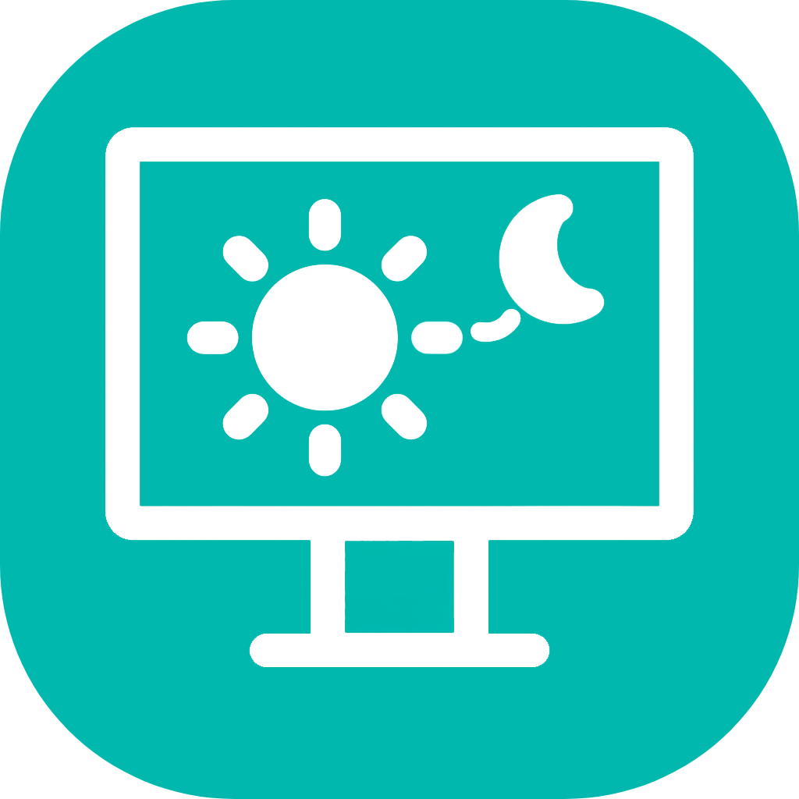
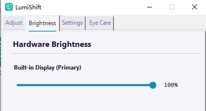
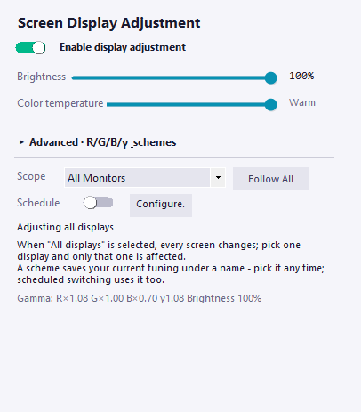
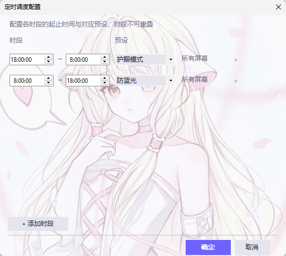

<div align="center">



# LumiShift

**Lightweight screen brightness & color temperature adjustment tool — easier on your eyes**

[]()  [](https://github.com/SummerRay160/LumiShift/releases/latest)  [](https://github.com/SummerRay160/LumiShift/releases)  [](https://github.com/SummerRay160/LumiShift/stargazers)

**[English](#introduction) · [简体中文](README.md) · [繁體中文](README.zh-Hant.md) · [Report Issues](https://github.com/SummerRay160/LumiShift/issues)**

</div>

---

## Introduction

LumiShift is an open-source screen adjustment tool for Windows. It's a single exe — just download and run, no installation needed. It packs multi-monitor brightness adjustment, Gamma correction, color temperature control, eye protection mode, and scheduled switching into one place, making long screen sessions a lot more comfortable.

---

## 🎯 Features

### 🖥️ Multi-Monitor Brightness



Got several monitors hooked up? LumiShift spots each one automatically — just drag the slider to tweak each screen's brightness independently. No more fumbling with the fiddly buttons on the monitor itself.

### 🎨 Gamma & Color Temperature



Fine-tune the R/G/B channels, Gamma value, and master brightness — or just drag a single warmth slider to quickly warm up or cool down the screen.

**Display schemes**: Save your tuned parameters and restore them with one click later — no need to readjust every time.

- **Unified Scheme**: color temperature adjustments sync to all monitors
- **Multi-Display Scheme**: save each monitor's parameters separately and combine them into one scheme. Primary vivid, secondary eye-friendly? Switch the whole set at once — no per-monitor tuning needed
- Four built-in presets (Standard, Anti-Blue, Eye Care, Gaming), plus support for saving custom parameters as schemes

**Multi-monitor management rules**

- Select **All Monitors** — adjustments sync to every screen
- Select a specific monitor — only that one is affected, others stay unchanged
- Monitors you haven't tuned individually show **Follow All** and track the global parameters; once tuned individually, they switch to **Independent** and decouple from the global settings
- To make a monitor follow the global parameters again, select it and click the **Follow All** button — its independent configuration will be cleared

> 💡 **Heads-up**: Switching back from a single monitor to All Monitors overwrites the other monitors with the primary monitor's parameters — double-check before you do it. R/G/B channels and γ tuning are tucked into the collapsible **Advanced** section — expand it when you need fine control.

### ⏰ Schedule



Standard mode during the day, eye care mode at night — set up your time slots and the app switches automatically on schedule.

- Set start and end times freely — overnight slots are supported (e.g. 22:00 – 06:00)
- Each slot auto-switches to its preset scheme when it starts
- Multi-monitor setups can assign a different scheme per slot, or apply a multi-display scheme directly
- The timeline at the top shows the whole day at a glance; overlapping slots are flagged in red
- Temporary manual tweaks during the day don't affect the schedule — it auto-resumes at the next slot

### 👁️ Eye Protection Mode


Replaces the system window colors with a soft eye-care tint, so your eyes tire less easily during long reading sessions.

---

## 📥 Download

Head to the [Releases](https://github.com/SummerRay160/LumiShift/releases/latest) page and grab the latest `LumiShift.exe`.

[](https://github.com/SummerRay160/LumiShift/releases/latest)

## 📋 Requirements

| Requirement | Version / Notes |
|:---:|:---|
| **OS** | Windows 10 / 11 |
| **.NET Framework** | 4.8 (built into Windows 10 1903+) |
| **Monitor** | DDC/CI support |

## 🔨 Build

Open `LumiShift.sln` in Visual Studio 2022 and build in Release configuration.

```bash
msbuild LumiShift.sln /p:Configuration=Release
```

<div align="center">

**⭐ If this project helps you, please give it a Star! ⭐**

Made with ❤️ by [SummerRay160](https://github.com/SummerRay160)

</div>
