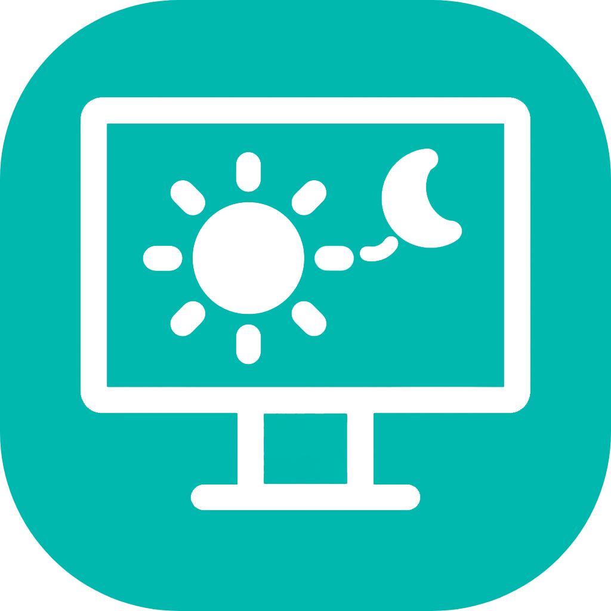
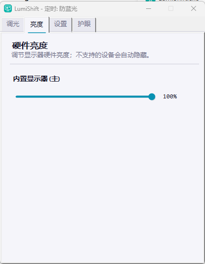
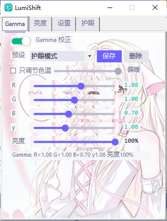
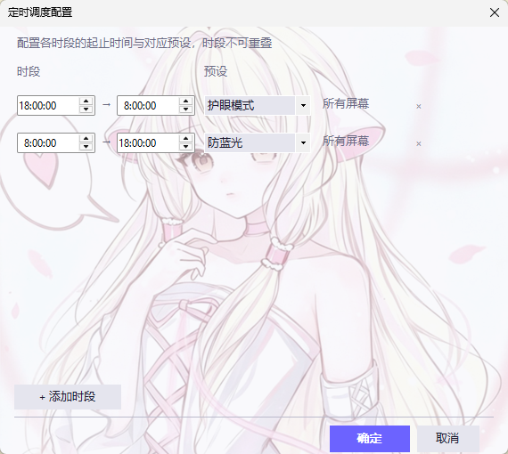
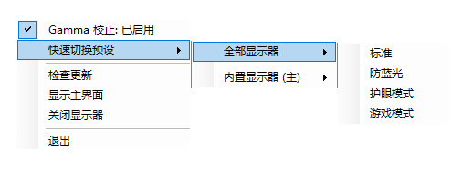
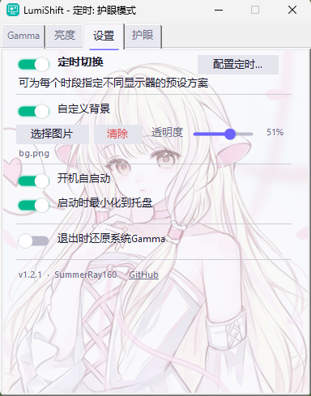

<div align="center">



# LumiShift

**輕量級螢幕亮度與 Gamma 校正工具 — 讓你的螢幕更護眼**

[](LICENSE)
[]()
[](https://github.com/SummerRay160/LumiShift/releases/latest)
[](https://github.com/SummerRay160/LumiShift/releases)
[](https://github.com/SummerRay160/LumiShift/stargazers)

**[简体中文](README.md) · [English](README.en.md) · [繁體中文](#介紹) · [問題回報](https://github.com/SummerRay160/LumiShift/issues)**

</div>

---

## 介紹

LumiShift 是一款 Windows 平台上的開源螢幕調節工具。一個 exe 檔案，下載就能用，不用安裝。它把多顯示器亮度、Gamma 校正、色溫調節、護眼模式和定時切換這些事都整合在一起，讓你的螢幕用起來更舒適。

---

## 🎯 功能特性

### 🖥️ 多顯示器亮度調節



接了好幾台顯示器？LumiShift 會自動認出每一台，你直接拖滑桿就能單獨調每台的亮度，再也不用去摸顯示器上那些難按的按鈕了。

- 自動識別所有連接的顯示器
- 拖一下滑桿就調好，會自動儲存
- 顯示器熱插拔不用重新啟動程式，會自動同步

### 🎨 Gamma 與色溫



不管你是想精細調 R/G/B 三通道、Gamma 值和主亮度，還是只想簡單拖一個滑桿把螢幕變暖一點，這裡都能搞定。

**顯示方案是什麼？** 簡單說就是「一套調好的參數」，存下來下次一鍵切回去，不用每次重新拖滑桿。

- **統一方案**：一套參數同步到所有顯示器。想讓每個螢幕看起來都一樣？選這個就對了
- **多屏方案**：把每台顯示器各自的參數打包存成一個方案。比如主屏要鮮豔、副屏要護眼，存成多屏方案後一鍵整套切換，不用一台一台調
- 內建了標準、防藍光、護眼模式、遊戲模式四個預設，也可以把自己的調法存成自訂方案

**多顯示器怎麼管？**

- 下拉選單選「所有顯示器」時，調整會同步到每一台
- 選具體某台顯示器時，只影響那一台，其他螢幕不動
- 沒單獨調過的顯示器會顯示「跟隨全部」，意思是它跟著全域參數走；一旦你單獨調過，就變成「單獨設定」，跟其他螢幕脫鉤
- 想讓某台顯示器重新跟著全域走？選中它點「跟隨全部」按鈕，獨立配置會被清掉

> 💡 **小提示**：從單台切回「所有顯示器」時會以主顯示器參數為準覆蓋全部，記得先確認。勾上「只調節色溫」可以省掉 R/G/B 三通道，只剩一個冷暖滑桿，簡單直接。

### ⏰ 定時排程



白天用標準模式，晚上自動切護眼模式？交給定時排程就行，到點自動切，不用你操心。

- 想幾點切就幾點切，跨午夜時段也支援（比如 22:00 – 06:00）
- 每個時段到了自動切換對應的預設方案
- 多顯示器可以為每個時段指定不同方案，或者直接套用多屏方案
- 頂部時間軸一眼看到全天安排，時段重疊會自動標紅提醒
- 白天臨時手動調一下也沒事，下個時段開始時會自動恢復排程

### 👁️ 護眼模式


把系統視窗顏色換成柔和的護眼色，長時間看文件也不那麼累眼。

- 內建三套預設色：綠豆沙、紙頁黃、天空藍
- 不喜歡預設？自己挑一個喜歡的顏色

### 🔔 系統匣



最小化到系統匣後不佔工作列，右鍵選單裡能快速做這些事：

- 按顯示器分組快速切換預設（標準 / 防藍光 / 護眼 / 遊戲）
- 開關 Gamma、檢查更新、顯示主介面
- 關閉顯示器、結束程式

### ⚙️ 其他設定



- **開機自啟**：開機就啟動，不用每次手動開
- **啟動時最小化到系統匣**：不打擾你工作
- **結束時還原 Gamma**：關程式時把螢幕恢復成原始狀態
- **通知偏好**：啟動、定時切換、狀態變更、顯示器變更這幾類通知想開哪條開哪條，也有一鍵總開關
- **自動檢查更新**：預設開啟，嫌煩可以關掉

### 🔄 自動更新

啟動時靜默檢查 GitHub Releases 上的新版本，也可以從系統匣選單手動檢查。

---

## 📥 下載安裝

前往 [Releases](https://github.com/SummerRay160/LumiShift/releases/latest) 頁面下載最新版 `LumiShift.exe`，雙擊就能執行，無需安裝。

[](https://github.com/SummerRay160/LumiShift/releases/latest)

## 📋 系統需求

| 需求 | 版本 / 說明 |
|:---:|:---|
| **作業系統** | Windows 10 / 11 |
| **.NET Framework** | 4.8（Windows 10 1903+ 已內建） |
| **顯示器** | 支援 DDC/CI（大多數現代顯示器都支援） |

## 🔨 編譯

使用 Visual Studio 2022 開啟 `LumiShift.sln`，選擇 Release 設定編譯。

```bash
msbuild LumiShift.sln /p:Configuration=Release
```

## 📁 專案結構

```
LumiShift/
├── BackgroundService.cs            # 背景服務（系統匣/排程/計時器）
├── Controls/                       # 自訂控制項
│   ├── FlatTabControl.cs           # 扁平化索引標籤
│   ├── GdiCache.cs                 # GDI 物件快取池
│   ├── ModernSlider.cs             # 現代風格滑桿
│   └── ToggleSwitch.cs             # 開關切換控制項
├── Infrastructure/                 # 核心基礎架構
│   ├── BrightnessController.cs     # WMI / DDC/CI 亮度控制
│   ├── GammaController.cs          # Gamma 校正 (SetDeviceGammaRamp)
│   ├── GcHelper.cs                 # GC 回收與工作集修剪
│   ├── EyeProtectionService.cs     # 護眼模式 (SetSysColors + 登錄檔)
│   ├── NightLightController.cs     # Windows 夜間模式控制
│   ├── MonitorManager.cs           # 顯示器管理 (EDID/熱插拔/位置推斷)
│   ├── NativeMethods.cs            # Win32 API 宣告
│   ├── ScheduleEvaluator.cs        # 定時排程時段評估與雜湊快取
│   ├── WeakEvent.cs                # 弱事件模式實作
│   ├── LightweightJson.cs          # 輕量級 JSON 解析器
│   └── IBrightnessController.cs    # 亮度控制介面
├── Models/
│   ├── DisplayScheme.cs            # 顯示方案模型（統一/多屏）
│   ├── GammaConfig.cs              # Gamma 配置與來源名稱工具
│   ├── PresetDefinitions.cs        # 預設定義
│   └── UserSettings.cs             # 使用者設定模型
├── Properties/
│   └── AssemblyInfo.cs             # 組件資訊
├── Resources/
│   └── DesignConstants.cs          # 主題與設計常數
├── Services/
│   ├── DisplayGammaStateService.cs # 全域/逐台顯示器 Gamma 狀態管理
│   ├── DisplaySchemeService.cs     # 顯示方案彙總
│   ├── PresetService.cs            # 預設解析（內建 + 自訂）
│   ├── SaveDisplaySchemeDialog.cs  # 儲存顯示方案對話框
│   ├── SettingsStore.cs            # 設定持久化
│   ├── UpdateService.cs            # 自動更新服務
│   └── UpdateDialog.cs             # 更新提示對話框
├── Form1.cs                        # 主表單邏輯
├── Form1.Designer.cs               # 主表單設計工具
├── ScheduleConfigForm.cs           # 定時排程配置表單
├── Program.cs                      # 進入點（單一實例 + 命令列參數）
├── App.config                      # 應用程式配置
└── LumiShift.csproj                # 專案檔
```

## 🛠️ 技術棧

[]()
[]()
[]()
[]()
[]()

| 功能 | 技術 |
|:---:|:---:|
| **框架** | .NET Framework 4.8 / Windows Forms |
| **亮度控制** | WMI + DDC/CI (`dxva2.dll`) |
| **Gamma 校正** | GDI32 `SetDeviceGammaRamp` |
| **護眼模式** | User32 `SetSysColors` + 登錄檔 |
| **夜間模式** | 登錄檔 `CloudStore` 讀寫 |
| **顯示器管理** | EDID 解析 + Win32 API |
| **自動更新** | GitHub Releases API |
| **CI/CD** | GitHub Actions（自動編譯 + Release） |

## 📜 授權條款

本專案基於 [GPL-2.0 License](LICENSE) 開源。

[](LICENSE)

---

<div align="center">

**⭐ 如果這個專案對你有幫助，請給一個 Star 支持一下！ ⭐**

Made with ❤️ by [SummerRay160](https://github.com/SummerRay160)

</div>